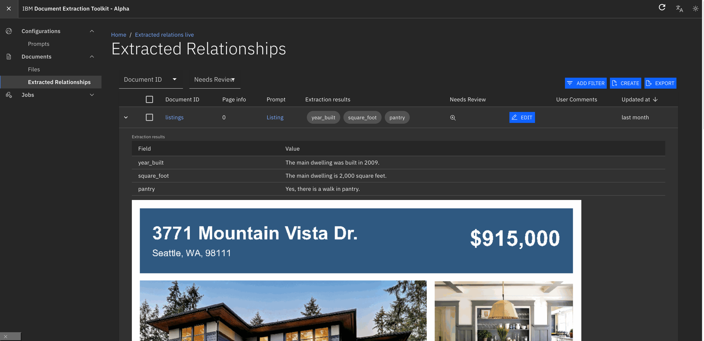
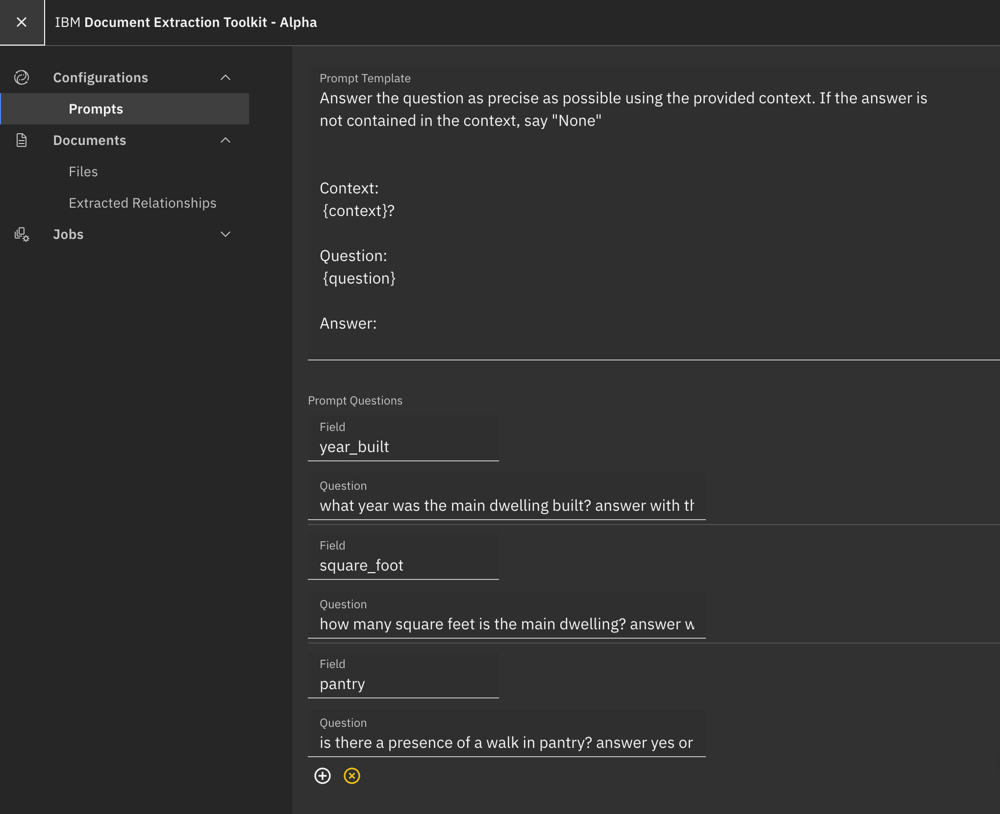
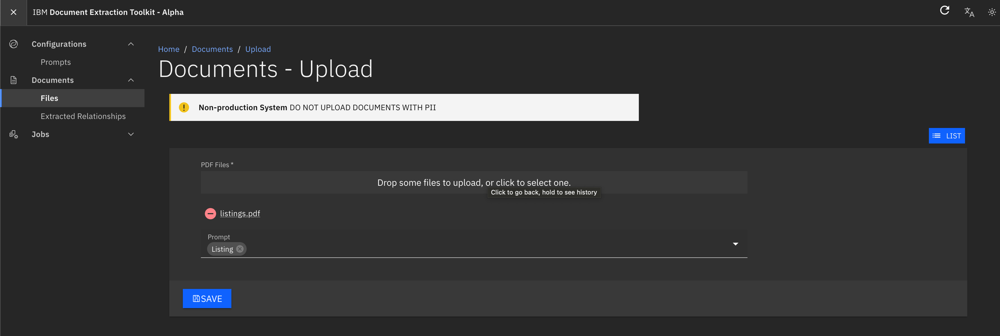

# Document Extraction Toolkit

Prototype UI for handling automated document extraction tasks using WatsonX models on PDF files.

Create prompts from the UI for usage against uploaded documents.

    

    

    

## Components

This web application consists of the following components:

- React Web UI `webclient/client`
- Express Web Server `webclient/server`
- Python (Procrastinate) worker `server/procrastinateworker`
- Sqitch database schema change management `sqitch`
- PostgresT (provided by dockerhub)
- Minio S3 (provided by dockerhub)
- Postgres DB (provided by dockerhub)

## Prerequisites (Local Development)

- Rancher Desktop/Docker
- Pyenv `pip install virtualenv`

## Environment Variables (Local Development)

1. From root directory, run `cp .env.example .env`
2. From root directory run `cp ./server/procrastinateworker/.env_example ./server/procrastinateworker/.env`
3. Modify the GENAI_KEY value in the file `./server/procrastinateworker/.env`
4. From webclient directory, run `npm i` and then `npm run setupenv` - this will copy the .env files for local development

## Startup Sequence for Local Development (first time)

1. From project root directory, run `docker compose -f docker-compose.yaml up --force-recreate`
2. Wait for postgres DB to start up, and wait for sqitch schema to finish provisioning tables
3. ctrl-c to stop the process once logs are quiet
4. Run `docker compose -f docker-compose.yaml -f docker-compose.minio.yaml up`
5. From `webclient` run `npm i`
6. From `webclient` run `npm run install:all`
7. From `webclient` directory, run `npm run develop:server`
    - This starts the express server, it monitors code changes in `webclient/server`
    - This server connects to s3/minio and postgresT
8. From `webclient` directory, run `npm run develop:client`
    - This starts the web application, it monitors code changes in `webclient/client`
9. From project root folder make a new python virtual environment `python3 -m venv detpyvenv` (detpyvenv is the name of the virual env)
10. From project root folder activate the new python virtual environment `source ./detpyvenv/bin/activate`
11. From `server` directory, run `pip install -r requirements.txt`
12. From `server` directory, run `export PYTHONPATH=.`
13. From `server` directory, run `procrastinate --verbose --app=procrastinateworker.worker.app worker`
    - This starts the Procrastinate worker that processes the PDF files

## Using the UI

1. Visit the web UI at http://localhost:3003/
2. The postgresT endpoint is at http://localhost:3000/
3. The minIO s3 admin console is available at http://localhost:9001/

## Reset Database

The database is only temporary, it can be reset by simply running `docker compose -f docker-compose.yaml up --force-recreate`

## Bugs, Known Issues, TODOs

1. Users/Roles are only placeholders and do not actually work.

## Terraform

1. Install CLI and plugins - https://cloud.ibm.com/docs/schematics?topic=schematics-schematics-cli-reference
2. Install Terraform https://developer.hashicorp.com/terraform/tutorials/aws-get-started/install-cli
3. Create a IBM Cloud resource group
4. Create a Code Engine Project in that same resource group
5. Create a Schematics workspace

Schematics workspace settings:
| Field                      | Description                                          |
|----------------------------|------------------------------------------------------|
| URL                        | [https://github.com/IBM/document-extraction-toolkit/tree/main/terraform](https://github.com/IBM/document-extraction-toolkit/tree/main/terraform) |
| Use full repository        | Uncheck                                              |
| Personal Access Token      | Not required (if you fork this repo, you will need one) |
| Terraform version          | terraform_v1.5                                       |
| Resource group             | Use the one created previously                       |

Once the workspace is created, please update the following variables:
| Field           | Description                                                                                           |
|-----------------|-------------------------------------------------------------------------------------------------------|
| project_name    | Unique name of the project with no spaces. It will be used to prefix resources created by the template.|
| resource_group  | Name of the resource group previously created.                                                        |
| ce_project_id   | GUID of the Code Engine project. You can find this either on the URL path or the "Details" button.      |
| cr_namespace    | Use a unique name. Do not use the default value.                                                        |
| cr_registry     | Use private.icr.io for global. Do not use the public one.                                              |
| region          | Use the same region where your resource group was created. All new resources are deployed to this region.|
| use_ssh_key     | Determines if the SSH deploy key is to be used when pulling from the repo. Applies to private repos only.   |
| ssh_deploykey   | Create an SSH deploy key used for container registry and Code Engine deployments when using with a private repo. Mark as sensitive.   |
| genai_apikey    | Your WatsonX API key. Sensitive.                                                                      |
| genai_url       | WatsonX service endpoint URL.                                                                         |

Verify all settings and execute a generate plan. It should succeed, and then you can proceed to apply plan. If apply plan fails, you can try again one more time and it will start again. Some of the elements are timed, due to limitations on the provider. The plan should take about less than 2 hours to finish from start to finish and provisions all the necessary backend services (appid, s3), container registry, code engine image builds, code engine deployments. You will receive a fully functionaly web application after the template finishes.

The code engine application **-worker needs to be manually adjusted after the template executes to be a daemon instead of a task (due to a terraform bug). 

## Further Development

This application is provided as a template for building a web UI that allows users to create tasks for watsonx to process.

| Component                     | Link                                                            |
|-------------------------------|------------------------------------------------------------------------|
| UI                            | [https://marmelab.com/react-admin/](https://marmelab.com/react-admin/) |
| Database change management    | [https://sqitch.org/docs/manual/sqitchtutorial/](https://sqitch.org/docs/manual/sqitchtutorial/) |
| PostgresT                     | [https://postgrest.org/](https://postgrest.org/) |
| Procrastinate                 | [https://procrastinate.readthedocs.io](https://procrastinate.readthedocs.io) |

